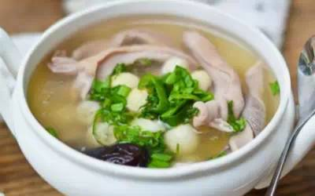
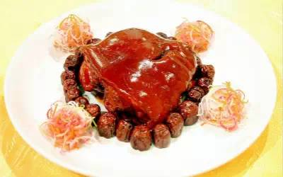
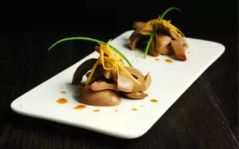
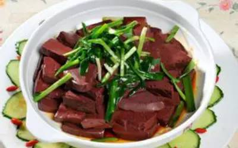
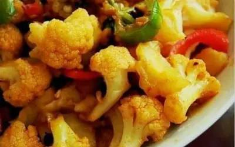
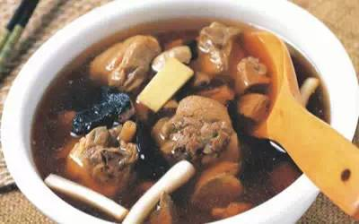
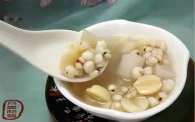
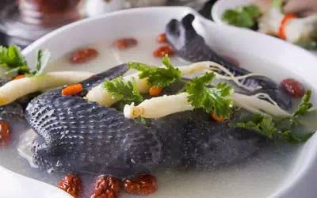
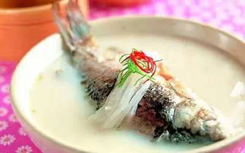
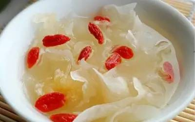

# 一张精心准备的肿瘤食疗处方单
---

<!-- toc -->

> 肿瘤病人大都要经过手术、放疗、化疗，这时身体器官受到很大损伤，如不注意各方面的调理，身体就不能得到快速康复。那么，病人在康复阶段该如何调理饮食呢？

> 康德乐药师为肿瘤病人提出三条建议 
食药并重，合理忌口，科学进补

## 猪肚莲子
> 有健脾益胃和补气的功效

1. 准备猪肚、白莲、干贝、枸杞和党参

2. 砂锅水烧热，把莲子塞到猪肚里后放到锅里炖

3. 加入干贝、枸杞和党参

4. 中间要不时翻动，这样才煮得透

5. 最后放盐调味即可出锅

## 红枣煨肘
> 补脾益胃、滋阴养血，阴虚血虚者尤宜

1. 猪肘去骨洗净，入锅炙皮后在肉上剞十字花刀

2. 投入放有姜、葱、料酒和川盐的汤锅中略煮

3. 红枣洗净去核，放入冰糖炒化，加水上笼蒸约3小时， 捞出红枣

4. 把汁滗入锅后，将猪肘翻扣入盘，红枣围摆在其周围

5. 锅置火上，用小火收汁至色红亮油时离火

## 归参山药猪腰
> 养血、益气、补肾，适用于血损肾亏所致的心悸、气短、自汗等症

1. 将猪腰切开，剔去筋膜、肾孟，洗净

2. 当归、党参、山药装入纱布袋内，扎紧口

3. 猪腰与药袋一同放人铝锅内，加水适量，清炖至猪腰熟透

4. 捞出猪腰，冷却后，切成薄片，入盘

5. 拌入酱油、醋、姜丝、蒜末、香油即可

## 清炒猪血
> 有补气益血、解毒等功效，适用于眩晕、腹胀等症

1. 猪血切成大块，放入开水锅中焯一下，捞出滤干水分，切小块

2. 姜洗净，切丝

3. 锅内放油后，烧至七成熟，下猪血及料酒、姜、盐翻炒，起锅时放入味精即可

## 香菇炒菜花
> 菜花开胃、宽胸、壮筋骨，香菇能补气强身

1. 准备：菜花在淡盐水里泡泡、鲜香菇洗净切块备用、葱，蒜，干辣椒切末

2. 上锅热放干辣椒炒香，再加葱蒜炒香

3. 放香菇翻炒片刻

4. 加入菜花翻炒，关小火，调味翻炒均匀即可关火装盘

## 黄芪甲鱼汤
> 有益气补气、滋阴养血的功效

1. 黄芪枸杞子洗净，甲鱼斩块汆水，姜切片待用

2. 净锅上火，放入色拉油将甲鱼微炸一下控油

3. 入汤锅，放入清汤、黄芪、姜片、枸杞子、甲鱼，大火烧开转小火炖45分钟调味即成

## 山药薏苡仁粥
> 山药双补气阴，薏苡仁可利湿祛邪，均为补脾之要药

1. 准备薏米、糯米、几个蜜枣、山药去皮切成块

2. 把上述材料一起放在锅内，加多于材料二倍的水

3. 盖上盖子，按至煮粥键，煮20分钟

4. 等高压锅气排完后，盛出可食用

## 枸杞子乌鸡汤
> 滋补肾阳，益气血等功效

1. 乌鸡洗干净切好

2. 把枸杞子和红枣洗好放锅里煲20分钟

3. 把乌鸡倒下锅一起煲40分钟

4. 出锅前加盐调味加点香油

## 砂仁鲫鱼汤
> 可醒脾开胃，辅治食欲不振

1. 鲫鱼开肚清理干净，把砂仁塞进鱼肚子里（砂仁要拍碎），并切好几片姜备用

2. 热锅下油，把鲫鱼放锅里，用中火把鱼两面煎黄

3. 把煎好的鱼放瓦锅里，加姜片

4. 加两碗水大火烧开，水开后调小火继续煲

5. 煲至汤变浓白时熄火（约20分钟），加适量盐和葱段即可

## 枸杞子银耳冰糖羹
> 有滋阴润肺、补肾阳、益胃生津等功效

1. 准备好银耳、冰糖、枸杞子
2. 银耳提前泡发，洗净、撕小朵备用
3. 枸杞子洗净，用冷水浸泡片刻
4. 银耳入沙煲，加入冷水；大火煮开，小火炖煮30分钟
5. 倒入枸杞子，炖煮10分钟
6. 加入冰糖，煮5分钟，炖至糖化
7. 炖好的银耳羹盛入碗中，温热食用

> ▲文章图片来源于网络，做法摘自豆果网