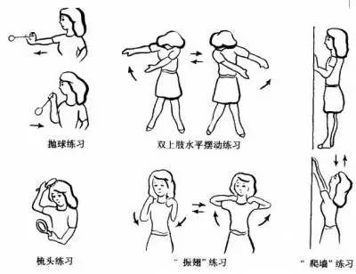

# 肿瘤患者如何运动
---

> 2016-04-05 豆豆 中国医大一院肿瘤内科 中国医大一院肿瘤内科 
对于肿瘤病人来说，适量的运动，可增加患者机体的抵抗力，更可以通过运动增强信心，拥有好心情！那么肿瘤病人做怎样的运动更合适呢？ 
肿瘤手术后的病人，如恢复良好，散步、气功、太极拳或是做操、慢跑等都是非常不错的选择。而放、化疗之后的患者，锻炼也没有太多的限制，如身体情况允许，应尽早开始锻炼，但需要注意锻炼强度，从低强度的散步开始，逐步提高运动强度，以运动后心情愉快，不觉得累为好。需要注意的是，一定要避开严重骨髓抑制期，即血细胞降低时。

> 不同类型的肿瘤患者还可通过特定的锻炼动作帮助恢复器官功能。呼吸系统肿瘤如肺癌病人，可以吹吹气球，多做深呼吸，逐步恢复并增强肺功能。而消化系统肿瘤，如胃癌、肠癌、肝癌等患者，可以通过适当的运动增加食欲，改善消化功能。乳腺癌病人在术后应早期进行患侧肢体锻炼，“爬墙”、“振翅”等都是很好的锻炼方法，还要多做握拳等活动，可逐渐由手指和手腕屈伸、握拳运动过渡为坐位肘关节屈伸、患侧上肢伸直、抬高、内收、屈曲等（具体动作详见下图）。适量的运动不仅可以缓解内分泌治疗的副反应，还有证据表明适度的运动可以减低乳腺癌的复发风险。

> 每个人都可以根据自己的情况选择喜欢的锻炼项目。锻炼身体时必须掌握好运动量，既要使身体各部分都得到最充分的活动，又不能使身体感到疲乏。

> 一般来说，锻炼到微微出汗，略觉兴奋，自我感觉舒服时就可以结束了，不要过度，或是为了完成自己设定的目标而强迫自己，最后累得筋疲力尽，精神不振，那不是锻炼的目的。如果运动中出现身体不适，体温升高、病情复发等不适，应停止锻炼，以免发生意外。需要注意的是，如果是有骨转移的患者，活动要慎重，需在医生指导下进行。